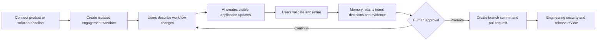
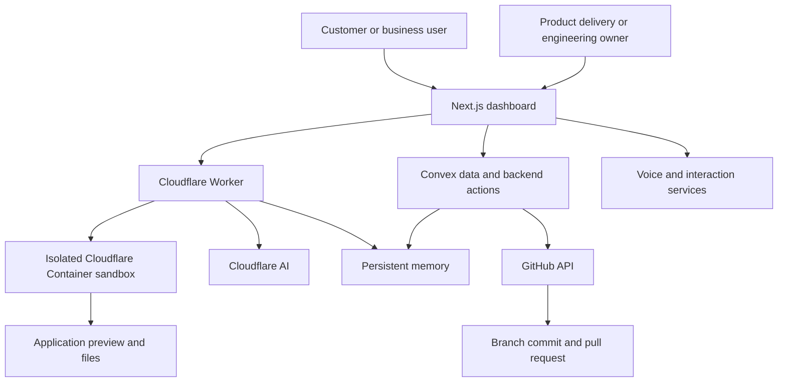

# FDE-Toolkit

## Governed customer-to-production delivery for enterprises, SaaS vendors, and systems integrators

FDE-Toolkit helps organizations co-build AI and software workflows with customers and business users without losing engineering control.

It provides isolated engagement sandboxes, AI-assisted application changes, persistent decision context, live validation, and engineering-native promotion into GitHub branches and pull requests.

The core promise:

> Scale customer-specific delivery without scaling one-off engineering.

## Who it is for

| Customer | Business problem | FDE-Toolkit outcome |
|---|---|---|
| **Enterprise AI and transformation teams** | High-priority workflows stall between workshops, prototypes, architecture review, and engineering delivery | A governed environment to co-build with users, validate working experiences, and hand approved changes to internal engineering |
| **SaaS and AI product vendors** | Strategic customer work creates roadmap insight but also forks, support burden, and product drift | A controlled design-partner loop that separates reusable product patterns from account-specific requests |
| **Systems integrators and consulting firms** | Delivery teams repeatedly reinvent discovery, prototyping, evidence capture, and engineering handoff | A repeatable forward-deployed delivery method that improves reuse, visibility, governance, and margin |

Primary users include forward-deployed engineers, solution architects, AI product leaders, enterprise architects, delivery leads, product managers, and engineering reviewers.

## The problem

Traditional discovery and software delivery are separated by multiple handoffs:

```text
Workflow discussion
    -> meeting notes
    -> requirements
    -> ticket
    -> engineering queue
    -> implementation
    -> user review
```

Context is lost at every transition. Prototypes become disposable. Customer-specific branches become permanent. Systems integrators rebuild similar solutions across accounts. Enterprise pilots struggle to cross the gap into governed production delivery.

FDE-Toolkit creates one continuous, reviewable loop:

```text
Business intent
    -> isolated working experiment
    -> user validation
    -> retained decisions and evidence
    -> human approval
    -> engineering pull request
```

## Business value

- **Faster validation:** replace long requirement cycles with working, reviewable experiments
- **Higher reuse:** convert customer learning into product patterns, templates, and delivery IP
- **Lower delivery risk:** isolate generated changes until people and controls approve promotion
- **Cleaner engineering handoff:** carry intent, constraints, evidence, and change history into review
- **Reduced product entropy:** avoid permanent customer forks and uncontrolled account-specific drift
- **Improved services economics:** standardize delivery and reduce reinvention across engagements

## Product flow



## Core capabilities

| Capability | Description |
|---|---|
| **Project and engagement administration** | Connect a codebase or solution baseline, create a customer or business program, and invite participants |
| **Isolated sandboxes** | Separate filesystems, previews, users, repositories, and execution boundaries for each engagement |
| **Workflow-native discovery** | Capture requests through natural language and voice while retaining the original business context |
| **AI-assisted changes** | Convert workflow intent into visible application changes inside a bounded environment |
| **Persistent decision memory** | Preserve requirements, constraints, experiments, feedback, and change history across the engagement |
| **Live validation** | Let users inspect, test, clarify, and refine the working experience before engineering promotion |
| **GitHub-native promotion** | Import repositories, create branches, commit approved changes, and open pull requests |
| **Change and evidence synthesis** | Attach reviewable summaries, decisions, and engagement history to the engineering artifact |
| **Human-controlled governance** | Keep product, architecture, security, and engineering owners accountable for promotion |

## Segment-specific operating models

### Enterprise teams

Use FDE-Toolkit to validate a high-value AI or workflow use case with business users before committing to a large production program. The output is not merely a demonstration. It is a working, governed engineering input with retained context.

Representative use cases:

- Claims, case, exception, or investigation workflows
- Internal operations and employee productivity applications
- AI-assisted customer service and knowledge workflows
- Regulated decision-support interfaces
- Enterprise integration and workflow modernization pilots

### SaaS and AI vendors

Use FDE-Toolkit to run strategic design-partner programs while protecting the integrity of the core product. Customer-specific experiments can be evaluated for reuse before they become roadmap items, configuration patterns, extensions, or rejected one-offs.

Representative use cases:

- Enterprise design-partner programs
- Vertical workflow acceleration
- Customer-specific integration prototypes
- New module and feature validation
- Forward-deployed product engineering

### Systems integrators

Use FDE-Toolkit as a reusable delivery layer across client programs. Standardize the path from discovery through prototype, evidence capture, client review, and engineering handoff while retaining reusable assets and implementation knowledge.

Representative use cases:

- AI transformation proof-of-value programs
- Industry solution accelerators
- Repeatable implementation playbooks
- Client co-innovation workshops
- Managed forward-deployed engineering services

## Architecture



### Major components

```text
FDE-Toolkit/
├── worker/        Cloudflare Worker, sandbox API, AI code generation, file serving
├── dashboard/     Next.js application, admin UI, participant workspace, Convex backend
├── convex/        Schema, mutations, actions, and GitHub integration
└── Dockerfile     Container image used by each sandbox
```

## Enterprise governance principles

AI-generated changes should be treated as untrusted until reviewed and validated. A production deployment should include:

- Isolation between organizations, projects, repositories, users, and sandboxes
- Minimum-privilege credentials for GitHub, models, and external services
- Secret scanning and prevention of credentials entering prompts or generated files
- Limits on files, commands, tools, runtime, and resource consumption
- Dependency, license, security, quality, and policy checks
- Complete change history, decision context, evidence, and user attribution
- Human approval before opening, merging, or deploying changes
- Data retention and deletion policies appropriate to each engagement

## Recommended pilot

Start with:

1. One high-value workflow with an accountable business owner
2. One representative product repository or approved solution baseline
3. Five to ten business users or design-partner participants
4. Explicit architecture, security, and promotion boundaries
5. A measurable target such as validation time, reuse, handoff quality, or reduced rework

The pilot should prove three things:

- Users can validate workflow intent through a working experience
- The organization can retain decisions and evidence across handoffs
- Approved learning can enter the engineering process without bypassing governance

## Run locally

```bash
npm install
cd worker && npm install
cd ../dashboard && npm install
```

Then run the Worker, Convex, and Next.js dashboard in separate terminals. See the complete [setup and deployment guide](docs/SETUP.md) for service accounts, environment variables, local execution, deployment, and security reminders.

## Positioning and go-to-market

See [Enterprise positioning and go-to-market](docs/ENTERPRISE-POSITIONING.md) for the target customer profiles, buyer messages, value pillars, alternatives, pilot offer, and messaging guardrails.

## Public-safe repository note

This public repository should not contain customer data, proprietary client code, protected information, production credentials, or confidential employer assets. Use synthetic applications and appropriately authorized repositories for demonstrations.
